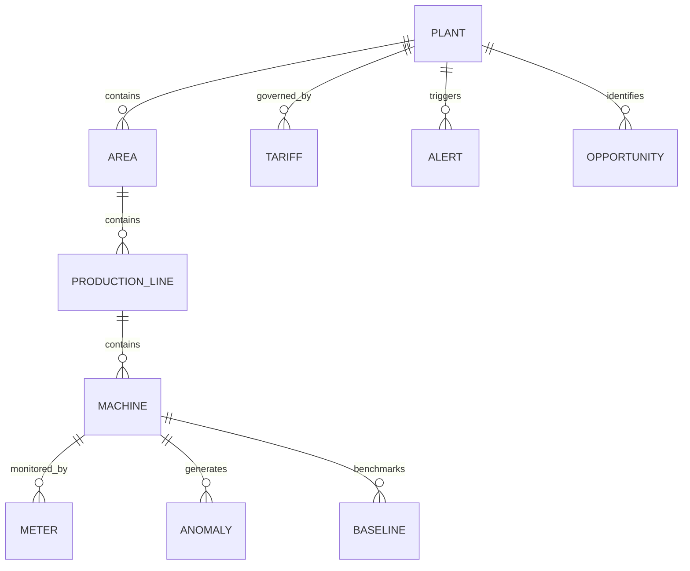

# EnerOps — Industrial Energy & Operations Intelligence Platform
## Comprehensive Project Documentation & Architecture Guide

---

## 1. Executive Summary & Purpose

**EnerOps** is an enterprise-grade Industrial Energy Management & Operations Intelligence Platform (EMS / IIoT) designed for modern manufacturing plants, discrete fabrication facilities, and multi-site industrial complexes.

### Purpose
The primary purpose of EnerOps is to bridge the critical gap between **industrial energy consumption** and **manufacturing operations**. By ingesting real-time telemetry from smart meters, PLCs, Modbus/MQTT gateways, and production lines, EnerOps delivers granular visibility, automated anomaly detection, AI-driven cost-saving recommendations, renewable integration tracking, and audit-ready ESG carbon accounting.

```
+-----------------------------------------------------------------------------------+
|                                 ENEROPS PLATFORM                                  |
|                                                                                   |
|  [ Industrial Telemetry ]  -->  [ FastAPI Core & AI ]  -->  [ Next.js Executive  ] |
|   - Modbus / MQTT                - Anomaly Heuristics        - Real-Time Gauges   |
|   - Multi-Utility Meters         - SEC Correlator            - Renewable Tracking |
|   - Production Lines             - Diurnal Forecasting       - AI Copilot Chat    |
+-----------------------------------------------------------------------------------+
```

---

## 2. Problem Statement

Modern industrial enterprises face several high-friction operational and financial challenges:

1. **Lack of Granular Visibility (Data Silos)**:
   - Most factories only receive monthly utility bills, offering zero visibility into which specific machine, shift, or process is driving excessive consumption.
   - Sub-metering data is often trapped inside isolated SCADA, PLC, or legacy on-prem systems.

2. **Costly Peak Demand Penalties & Dynamic Tariffs**:
   - Industrial utility tariffs levy steep penalties for exceeding contracted maximum demand (kVA/MW).
   - Time-of-Day (ToD) / Time-of-Use (ToU) peak-rate spikes significantly inflate manufacturing overheads without smart load scheduling.

3. **Invisible Energy Waste & Inefficiency**:
   - Machines left idling during shift changes or non-production hours consume up to 20-30% of baseline power.
   - Faulty compressors, unbalanced pneumatic lines, and degraded chiller systems bleed power without immediate mechanical failure indicators.

4. **Disconnected Energy vs. Production Metrics**:
   - Energy consumption is rarely normalized against real-time production output, making it impossible to accurately calculate **Specific Energy Consumption (SEC = kWh/unit)** or correlate energy with **Overall Equipment Effectiveness (OEE)**.

5. **ESG Compliance & Carbon Accounting Pressures**:
   - Increasing regulatory standards (BRSR, ISO 50001, GHG Protocol, CBAM) demand verifiable Scope 1 (direct fuels) and Scope 2 (grid electricity) emissions tracking.

---

## 3. The EnerOps Solution

EnerOps solves these challenges with a unified, cloud-edge hybrid architecture:

| Challenge | EnerOps Solution |
| :--- | :--- |
| **Coarse Monthly Billing** | Sub-second and 15-minute interval sub-metering mapped down to individual machines and lines. |
| **Peak Demand Penalties** | Real-time demand radial gauges, threshold alerts, and peak load shifting recommendations. |
| **Energy Waste & Degradation** | Heuristic & ML-based Anomaly Detection identifying load spikes, phase imbalance, and idle losses. |
| **Production Disconnect** | Dynamic SEC (kWh/unit) tracking, shift-wise benchmarking, and OEE-energy correlation. |
| **Clean Energy Management** | Solar PV generation tracking, Battery Energy Storage (BESS) state-of-charge, and grid offset analytics. |
| **ESG / Carbon Reporting** | Automated Scope 1 & 2 carbon calculations ($tCO_2e$) and one-click PDF/CSV executive reporting. |
| **Decision Friction** | Built-in conversational AI Copilot for natural-language energy auditing and diagnostic queries. |

---

## 4. Key Platform Features & Modules

### 4.1. Real-Time Operations & Energy Dashboard
- **Live Utility Monitoring**: Tracks primary electricity (MW), natural gas ($m^3/h$), compressed air (bar), steam (ton/h), and water consumption ($m^3/h$).
- **Peak Demand Radial Gauge**: Real-time visualization of current draw vs. contract demand threshold (MW limit) with automated safety margins.
- **Dynamic Diurnal Timeseries**: Overlay of hourly actual load against historical baseline targets.
- **Sub-Station Live Meters**: Real-time 3-phase telemetry (Voltage, Current, Active Power, Power Factor).

### 4.2. Machine-Level Telemetry & Asset Health
- **Asset Telemetry**: Deep-dive analytics for critical equipment (CNC Turning/Milling, Hydraulic Presses, Robotic Welders, Curing Ovens, Air Compressors, Chillers).
- **Health Index & Load Analytics**: Evaluates running load %, motor thermal trends (°C), vibration velocity ($mm/s$), and operational status (Running, Idle, Offline, Maintenance).
- **OEE & SEC Correlation**: Tracks productivity alongside power consumption to pinpoint energy waste per part produced.

### 4.3. AI Copilot & Anomaly Detection
- **Conversational Energy AI**: Interactive natural-language assistant capable of answering questions on consumption anomalies, cost projections, and operational shifts.
- **Anomaly Detection Engine**: Flags sudden spikes, baseline deviations, and abnormal off-peak loads with severity classification (Critical, Warning, Info).
- **24-Hour Diurnal Load Forecasting**: Predictive power curve based on historical cyclic patterns and shift schedules.

### 4.4. Renewable & Clean Tech Integration
- **Rooftop Solar PV Analytics**: Tracks real-time generation (kW), daily yield (kWh), performance ratio (PR %), and solar contribution share.
- **Battery Energy Storage System (BESS)**: Monitors battery state of charge (SoC %), charge/discharge cycles, and peak shaving dispatch.
- **Avoided Carbon & Grid Offset**: Quantifies clean energy utilization and avoided fossil fuel generation costs.

### 4.5. Cost & Dynamic Tariff Engine
- **Multi-Band Tariff Modeling**: Supports Time-of-Day (ToD) peak, standard, and off-peak tariffs, fixed charges, and demand charges.
- **What-If Simulation**: Simulates potential monthly cost savings achieved by load shifting or peak clipping.

### 4.6. Multi-Site Plant Hierarchy & Administration
- **Enterprise Hierarchy**: Structure assets across Enterprise $\rightarrow$ Plants $\rightarrow$ Production Areas $\rightarrow$ Lines $\rightarrow$ Machines $\rightarrow$ Physical Meters.
- **Multi-Plant Switching**: Seamlessly toggle between multiple industrial sites (e.g., Central Manufacturing Hub, Auto Corridor Assembly, Solar Park).
- **Role-Based Access Control (RBAC)**: User management for Plant Engineers, Energy Managers, Operators, and Sustainability Officers.

### 4.7. ESG Compliance & Automated Reporting
- **Automated Report Generation**: Daily Operations, ISO 50001 Energy Audit, Tariff & Billing, and ESG Carbon Emission reports.
- **Export Options**: Formats for PDF, Excel, and CSV download.

---

## 5. System Architecture & Tech Stack

```
+-----------------------------------------------------------------------+
|                            FRONTEND LAYER                             |
|  Next.js 14+ (App Router) | React 19 | Tailwind CSS | Recharts | Lucide|
+-----------------------------------▲-----------------------------------+
                                    │ HTTPS / REST / WebSockets
+-----------------------------------▼-----------------------------------+
|                         BACKEND API SERVICE                           |
|  FastAPI (Python 3.10+) | Pydantic v2 | SQLAlchemy 2.0 Async          |
|  - /v1/energy      - /v1/machines    - /v1/ai         - /v1/cost      |
|  - /v1/renewable   - /v1/production  - /v1/alerts     - /v1/reports   |
|  - /v1/hierarchy   - /v1/settings    - /v1/health                     |
+-----------------------------------▲-----------------------------------+
                                    │
+-----------------------------------▼-----------------------------------+
|                     DATA & TELEMETRY INGESTION                        |
|  PostgreSQL / TimescaleDB (Async Engine)                              |
|  Protocols: Modbus TCP/RTU Gateways | MQTT Brokers | REST Push        |
+-----------------------------------------------------------------------+
```

### Technology Breakdown

| Component | Technology | Description |
| :--- | :--- | :--- |
| **Frontend Framework** | Next.js (App Router, React) | Modern, responsive single-page industrial cockpit. |
| **Styling & UI** | Tailwind CSS & Lucide Icons | Clean, high-density industrial control room design. |
| **Visualization** | Recharts & SVG Custom Gauges | Composed charts, area trends, radial peak gauges, sparklines. |
| **Backend Framework** | FastAPI (Python) | High-performance asynchronous API layer with auto OpenAPI docs. |
| **ORM / Data Layer** | SQLAlchemy 2.0 & asyncpg | Non-blocking async database access with PostgreSQL/TimescaleDB. |
| **Data Validation** | Pydantic v2 | Strict request/response validation and schema enforcement. |
| **Industrial Telemetry** | MQTT / Modbus TCP / REST | Field device data acquisition and sub-meter integration. |

---

## 6. Data Model & Hierarchy

The database schema models industrial topology:



1. **`plants`**: Core industrial sites with geographical coordinates, timezone, currency, and contract demand limits.
2. **`areas`**: Departments or shops within a plant (e.g., Press Shop, Paint Shop, Assembly, Utilities).
3. **`production_lines`**: Manufacturing flow lines producing specific product families.
4. **`machines`**: Individual assets with rated power ($kW$), health index, status, and telemetry streams.
5. **`meters`**: Physical or virtual telemetry devices capturing active/reactive power, flow, and pressure.
6. **`tariffs`**: Time-of-Day utility contract pricing and demand surcharge structures.
7. **`anomalies` & `opportunities`**: Detected deviations, expected vs. actual energy, and estimated ROI savings.

---

## 7. API Reference Overview

| Endpoint | Method | Description |
| :--- | :--- | :--- |
| `/health` | `GET` | Health check endpoint. |
| `/v1/energy/metrics` | `GET` | Live multi-utility metrics, contract demand, and energy intensity. |
| `/v1/energy/timeseries` | `GET` | 24-hour diurnal power consumption vs. baseline curve. |
| `/v1/energy/live-meters` | `GET` | Active substation transformer and feeder meter readings. |
| `/v1/machines/list` | `GET` | Machine status, load percentage, energy consumption, and health index. |
| `/v1/machines/{id}/telemetry` | `GET` | Granular timeseries telemetry (kW, temp, vibration) for a selected machine. |
| `/v1/ai/chat` | `POST` | EnerOps AI Copilot conversational engine. |
| `/v1/ai/anomalies` | `GET` | Active AI-detected energy anomalies with severity breakdown. |
| `/v1/ai/forecast` | `GET` | Next 12-hour predictive load forecast. |
| `/v1/renewable/metrics` | `GET` | Solar generation, BESS battery state, and carbon avoided stats. |
| `/v1/cost/breakdown` | `GET` | Peak vs. off-peak cost analysis and savings potential. |
| `/v1/production/metrics` | `GET` | Specific Energy Consumption (SEC) and production units. |
| `/v1/alerts/list` | `GET` | Real-time threshold, power quality, and anomaly alerts. |
| `/v1/reports/list` | `GET` | Pre-generated audit reports and download links. |
| `/v1/settings/all` | `GET` | Global plant configuration, user database, and gateway status. |

---

## 8. Business Impact & Return on Investment (ROI)

- **10% – 18% Energy Cost Reduction**: Achieved through eliminating idle equipment draw, off-peak load shifting, and baseline tuning.
- **25% – 30% Peak Demand Surcharge Mitigation**: Instant alerts and predictive warnings prevent threshold exceedances.
- **100% ESG Audit Readiness**: Instant ISO 50001 and Scope 1/2 carbon emissions compliance reporting.
- **15% Increase in Machine Reliability**: Early anomaly detection in motor vibration and power draw prevents unplanned downtime.
